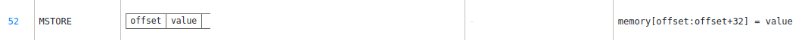
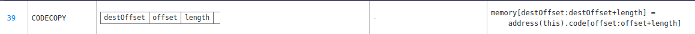
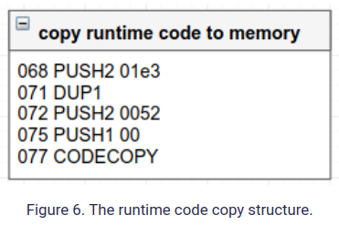

# MagicNumber

To solve this level, you only need to provide the Ethernaut with a Solver, a contract that responds to whatIsTheMeaningOfLife() with the right number.
Easy right? Well... there's a catch.
The solver's code needs to be really tiny. Really reaaaaaallly tiny. Like freakin' really really itty-bitty tiny: 10 opcodes at most.
Hint: Perhaps its time to leave the comfort of the Solidity compiler momentarily, and build this one by hand O_o. That's right: Raw EVM bytecode.

- Create a contract with inline assembly
- with < 10 opcodes
- With a function hat will `return 42;`

> Note: name of the funct doesn't matter. And `42` is NOT in hexa.

## Key

### Opcodes basics

- Reverse Polish Notation.

```
a + b      // Standard Notation (Infix)
a b add    // Reverse Polish Notation
```

https://jeancvllr.medium.com/solidity-tutorial-all-about-assembly-5acdfefde05c

- Declaring functions

```
assembly {
    function whatIsTheMeaningOfLife() -> result {
        result := 42
    }
}
let reponse = whatIsTheMeaningOfLife() // 42
```

- Analysis of opcodes
  https://blog.openzeppelin.com/deconstructing-a-solidity-contract-part-ii-creation-vs-runtime-6b9d60ecb44c/

- the difference between creation-time and runtime EVM bytecode
  https://blog.openzeppelin.com/deconstructing-a-solidity-contract-part-ii-creation-vs-runtime-6b9d60ecb44c/

## Solution walkthrough

https://medium.com/coinmonks/ethernaut-lvl-19-magicnumber-walkthrough-how-to-deploy-contracts-using-raw-assembly-opcodes-c50edb0f71a2

Theoretical context: https://blog.openzeppelin.com/deconstructing-a-solidity-contract-part-ii-creation-vs-runtime-6b9d60ecb44c/

Opcodes Ref: https://www.ethervm.io/#SWAP1

### Runtime code

1. `mstore(offset, value)`
   Store 0x42 value in memory. Ex. `mstore(0x80, 0x42)`

```asm
602a    // PUSH 0x2a (v: value is 0x2a)
6080    // PUSH 0x80 (o/position: memory slot is 0x80)
52      // mstore
```



2. `return(offset, length)`:
   Return the value stored previously

```
6020    // PUSH 0x20 (lenght: value is 32 bytes in size)
6080    // PUSH 0x80 (offset/position: value was stored in slot 0x80)
f3      // return
```


**Resulted runtime opcodes**:

```
602a60805260206080f3
length 10 bytes
```

EVM will then automatically save the runtime sequence 604260805260206080f3 to the blockchain

### Inicialization code

1. `codecopy(destOffset, offset, length)`:
   Copies runtime opcodes into memory. Params: target memory position to copy the code to, instruction number to copy from, and number of bytes of code to copy.
   > The creation code gets executed in a transaction, which returns a copy of the runtime code, which is the actual code of the contract



**Code copy structure**


> we copy 0x01e3 bytes starting from position 0x0052 into memory at position 0.

```
600a    // length: PUSH 0x0a (10 bytes)
60??    // offset: PUSH 0x?? (current position of runtime opcodes)
6000    // destOffset: PUSH 0x00 (destination memory index 0)
39      // CODECOPY
```

2. `return(offset, length)` in-memory opcodes

```
600a    // length: PUSH 0x0a (runtime opcode length)
6000    // offset: PUSH 0x00 (access memory index 0)
f3      // return to EVM
```

3. Add the final position of runtime opcode

```
0x600a600c600039600a6000f3 - > 602a60805260206080f3
 [0]                    [11]   [12]
~ 12~0x0c
600c    // offset: PUSH 0x0c (current position of runtime opcodes)
```

### Payload (init + runtime code)

```
0x600a600c600039600a6000f3602a60805260206080f3
```

Creat contract via `web3`:

```js
> var account = "0x4545c437d127B29bF0BB080DeEe97f159AB827d8";
> var bytecode = "0x600a600c600039600a6000f3602a60805260206080f3";
> web3.eth.sendTransaction({ from: account, data: bytecode });
```

> Contract created:
> https://rinkeby.etherscan.io/address/0x76DC487D428d7E7bCD1C9B996246bEa9c67325e0#code

4. `setSolver(address)` with the recently contract created

```js
contract.setSolver('0x76DC487D428d7E7bCD1C9B996246bEa9c67325e0');
```

<!--
## Not used
- Deploy a contract using `CREATE2`.

New addresses are a function of:

    0xFF, a constant that prevents collisions with CREATE

    The sender’s own address

    A salt (an arbitrary value provided by the sender)

    The to-be-deployed contract’s bytecode


```
new_address = hash(0xFF, sender, salt, bytecode)
```
Regarding the `bytecode`:
> An important detail is that the last ingredient in the calculation of the contract’s address is not its code, but its creation code. This is the code that is used to set up the contract, which then has to return its runtime bytecode. In most cases, this is the contract constructor, with its arguments, along with the contract code itself.
https://blog.openzeppelin.com/getting-the-most-out-of-create2/

- CREATE2 factory
```
contract Factory {
  function deploy(bytes memory code, bytes32 salt) public returns (address addr) {
    assembly {
      addr := create2(0, add(code, 0x20), mload(code), salt)
      if iszero(extcodesize(addr)) { revert(0, 0) }
    }
  }
}
```
https://blog.openzeppelin.com/deep-dive-into-the-minimal-proxy-contract/

1. Use Clone lib from openzeppeling to create a contract via OPCODE
```
clone(impl)
Deploys and returns the address of a clone that mimics the behaviour of implementation.
This function uses the create opcode, which should never revert.
https://docs.openzeppelin.com/contracts/4.x/api/proxy#Clones-clone-address-

impl = 3d602d80600a3d3981f3 // create code
impl += 6000602a905090
```
https://www.ethervm.io/#SWAP1
-->
